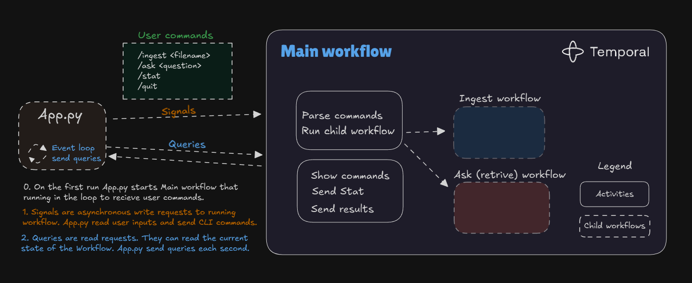

# RAG0 - Durable document processing with Temporal

This project aimed to demonstrate how to build durable document processing (RAG) workflows with Temporal using different tools for ingesting and retrieving:
- for ingesting - Docling, LlamaIndex, and Ollama with predifined workflow steps.
- for retrieving  - LangGraph Agentinc mode where AI agent can dicide which tools to use to answer question.
</br>

> [!WARNING]
> This document is not a "How to build a best in class RAG system". It is a "How to use Temporal for orchestrating document processing workflows to build Production Ready RAG system" guide.

## Why I created this project?

- Most examples online skip the end-to-end document pipeline.
- I wanted to show several ingestion and retrieval paths powered by Temporal.
- Temporal keeps long ingestion, grading, and retrieval runs durable, auditable, and scalable. 

## Project Layout

```
rag0/
├── src/
│   ├── app.py                 # CLI entry point used by Makefile targets
│   ├── activities/            # Temporal activities (ingest, parse, ask, stats)
│   ├── agents/
│   │   └── ask/               # LangGraph agent (graph, nodes, state, config)
│   ├── ingestion/             # Detection, parsers, chunking, storage, vector store
│   ├── temporal/              # Worker bootstrap wiring workflows + activities
│   ├── utils/                 # Shared helpers for logging, settings, tracing
│   └── workflows/             # Temporal workflows (main, ingestion, question)
├── parsed/                    # Structured artifacts emitted by ingestion
├── storage/
│   └── index/                 # ChromaDB embeddings and metadata cache
├── dev.sh                     # Helper script to launch Temporal + worker + CLI
├── Makefile                   # Automation entrypoints (install, worker, workflows)
└── README.md
```

## 📦 Stack

- [Python 3.11+](https://www.python.org/) with [`uv`](https://github.com/astral-sh/uv)-powered dependency management (Makefile fallback to `pip`).
- [Temporal Server](https://temporal.io/) and the [Temporal Python SDK](https://docs.temporal.io/dev-guide/python/) for workflow orchestration and scheduling.
- [Docling](https://github.com/DS4SD/docling) for text-first PDF ingestion, paired with optional [LlamaIndex](https://www.llamaindex.ai/) normalization.
- Vision-capable LLMs (e.g., [Qwen 3-VL](https://qwenlm.github.io/en/) via [Ollama](https://ollama.com/)) to OCR scanned PDFs and images.
- [LangGraph](https://langchain-ai.github.io/langgraph/) + [LangChain](https://www.langchain.com/) to build the ask agent, including grading nodes and query rewriting.
- [ChromaDB](https://www.trychroma.com/) as the embedded vector database backed by `storage/index/`.
- [Qwen3-4b](https://ollama.com/library/qwen3:4b) Qwen3 4b MoE model served via [Ollama](https://ollama.com/). 
- [Granite Embedding](https://ollama.com/library/granite-embedding) lightweight embedding model served via [Ollama](https://ollama.com/).
- OPTIONAL: [DeepSeek-OCR](https://github.com/deepseek-ai/DeepSeek-OCR) or [Qwen3-VL](https://github.com/QwenLM/Qwen3-VL) for vision parsing images.


## Workflow Overview


## CLI and  Event Loop



[src/app.py](cci:7://file://wsl.localhost/Ubuntu-22.04/home/alex/projects/rag0/src/app.py:0:0-0:0) runs the interactive loop: it starts `MainWorkflow`, then keeps polling Temporal (`get_next_prompt`, `get_last_result`) so the CLI always shows the latest prompts and results. When the workflow publishes available commands, the CLI returns the user’s choice through the `MainWorkflow.submit_input` signal, and the workflow responds by launching the appropriate child workflow (e.g., ingestion, ask) or activity such as `stats` or `quit`. 
</br>
*I have a plans to replace CLI tool with separated package using Golang and [BubbleTea TUI Framework](https://github.com/charmbracelet/bubbletea).*

## Ingestion Workflow


1. **Detect** – `detect_document_type_activity` inspects the payload (PDF, image, text) using `src/ingestion/detector.py` and selects the right parser strategy.
2. **Parse** – Docling handles text-first PDFs (`src/ingestion/doc_parser.py`), while the vision parser (`src/ingestion/vision_parser.py`) routes pages through a multimodal LLM for OCR.
3. **Normalize & Chunk** – `src/ingestion/chunking.py` standardizes metadata, deduplicates content, and generates retrieval-ready chunks.
4. **Persist** – Structured artifacts are written to `parsed/` via `store_parsed_document_activity`, preserving the raw extraction output for debugging.
5. **Index** – `update_vector_index_activity` leverages `src/ingestion/vector_store.py` to embed chunks, update the Chroma collection under `storage/index/`, and register document fingerprints for future refreshes.

> [!TIP]
> Since Temporal provide nice UI for debugging and observability you can open `http://localhost:8080` to see the Temporal UI.

Example of Ingestion Workflow in Temporal UI:


## Ask Workflow


1. **Dispatch** – The CLI issues `/ask` commands that enqueue `QuestionWorkflow` executions with an `AskAgentConfig` payload.
2. **Agent Loop** – `src/agents/ask/graph.py` builds a LangGraph with `grade_documents`, `rewrite_query`, and `grade_answer` nodes interleaved between reasoning and response.
3. **Retrieval** – Multi-query retrieval pulls from the Chroma index (`storage/index/`), deduplicating chunks and expanding neighborhoods when reflection requires new context.
4. **Synthesis** – Responses are generated through Ollama, enriched with citations, and backed by reasoning traces so operators can inspect decision points.
5. **Fallbacks & Stats** – If the LLM is unavailable, the fallback responder surfaces multiple context snippets. Activity metrics are sent through `src/activities/stats.py` to power future observability dashboards.


## Setup

### Python environment

```bash
python3 -m venv .venv
source .venv/bin/activate
make install  # installs rag0 (editable) with dev tooling via uv, fallback to pip
```

### Configure environment variables

```bash
cp .env.example .env
# edit .env with your preferred editor to adjust defaults
```

### Install Temporal CLI (if needed)

```bash
# macOS
brew install temporal

# Linux
curl -sSf https://temporal.download/cli.sh | bash
```

Once installed, run `temporal server --help` to confirm the CLI is available.

### Prepare Ollama models (optional)

```bash
ollama pull qwen3:4b
ollama pull granite-embedding
```

## Usage

### Launch local stack

```bash
./dev.sh
```

The script ensures the Temporal dev server is running, starts the RAG0 worker, and drops you into the interactive CLI session. Use the prompt to run `/ingest` and `/ask` commands; press `Ctrl+C` to exit. Background processes shut down automatically when the session ends.

### Direct CLI access (optional)

If you need to run the CLI without the helper script (for example, when targeting a remote Temporal cluster), activate your virtualenv and invoke:

```bash
python -m src.app --ollama-model qwen3:4b --ask-top-k 4
```

### Configuration

The CLI and workflows read from flags or environment variables (via `.env`):

- `--ollama-model` / `RAG0_OLLAMA_MODEL`
- `--ollama-base-url` / `RAG0_OLLAMA_BASE_URL`
- `--ask-top-k` / `RAG0_ASK_TOP_K`
- `--ask-max-reflections` / `RAG0_ASK_MAX_REFLECTIONS`
- `--ask-min-citations` / `RAG0_ASK_MIN_CITATIONS`
- `--ask-reflection-enabled` / `RAG0_ASK_REFLECTION_ENABLED`
- `--ask-temperature` / `RAG0_ASK_TEMPERATURE`

Set `RAG0_ASK_REFLECTION_ENABLED=0` in `.env` (or pass `--ask-reflection-disabled`) to turn off the reflective grading loop. These values flow into the shared `WorkflowConfig` and the `AskAgentConfig`, letting you tailor retrieval depth, reflection behavior, and model parameters per run.

## Developer Tooling

- `make lint` checks the tree with Ruff; `make format` applies Ruff formatting.
- `make typecheck` runs MyPy against `src/` and `tests/`.
- `make test` executes the pytest suite (CI captures coverage with `--cov=src`).
- Run `pre-commit install` after `make install` to enable the Ruff, MyPy, and pytest hooks.
- GitHub Actions (`.github/workflows/ci.yml`) mirrors these steps with uv-powered environments and uploads `coverage.xml`.

## Future Features

- API server to expose ingestion and ask workflows programmatically (Fast API package).
- Extended telemetry and stats dashboards sourced from workflow and activity metrics (Prometheus + Grafana).
- MCP package for using from your favorite LLM.
- Settings manager (CLI + file-based) for sharing configuration presets across teams (Golang + BubbleTea TUI).
- Scheduled re-ingestion and drift detection for long-lived document collections.
- Plug-in retrievers for external knowledge bases alongside the local Chroma index.

## Q&A

**Q:** Why use Temporal?  
**A:** Temporal makes the ingestion and ask orchestration more reliable by handling retries, state tracking, and long-running execution without custom infrastructure.

**Q:** Why do I need LangGraph if I can write logic with a Temporal workflow alone?  
**A:** You certainly can build everything inside Temporal, but this project demonstrates how familiar tools like LangGraph and LlamaIndex can plug into Temporal to add agentic retrieval logic without rebuilding it from scratch.
