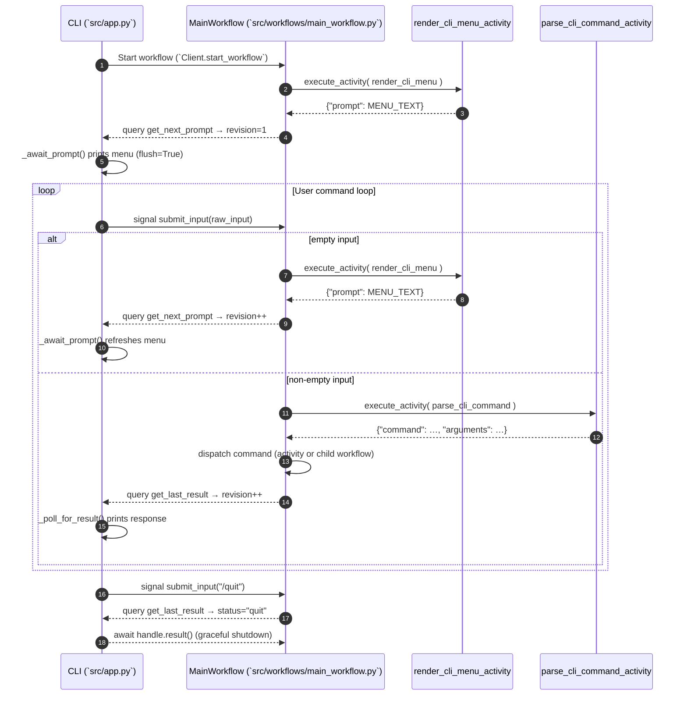

# CLI ↔ Temporal Workflow Event Timeline

## Notes from First-Run Investigation
- Initial menu text is emitted by `render_cli_menu_activity`; the CLI polls `MainWorkflow.get_next_prompt` via `_await_prompt`.
- Adding `flush=True` to the CLI print ensures the menu renders before the first user input even when stdout buffering is enabled.
- Workflow activity completion events confirm the menu was produced; the missing display was caused by buffered output on the CLI side.
